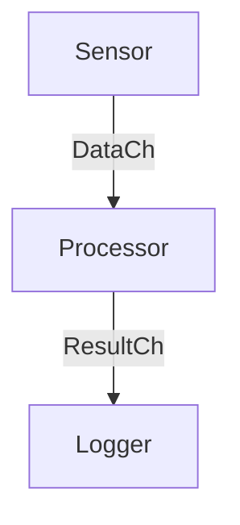

# Go Routines and Channels Challenges

This repository contains a series of challenges to help you learn and master Go routines, channels, mutexes, and their interactions in Go. Each challenge builds on the previous one, gradually increasing in complexity.

## Challenge 1: Basic Goroutines

**Objective:** Learn how to create and manage basic goroutines.

**Task:** Write a program that launches a goroutine to print numbers from 1 to 5 with a delay of 1 second between each print.

**Code:** [`goRoutinesAndChannels/1_basicGoroutines/main.go`](../goRoutinesAndChannels/1_basicGoroutines/main.go)

## Challenge 2: Basic Channels

**Objective:** Learn how to use channels to communicate between goroutines.

**Task:** Write a program that launches a goroutine to send numbers from 1 to 5 to a channel, and the main function should receive and print these numbers.

**Code:** [`goRoutinesAndChannels/2_basicChannels/main.go`](../goRoutinesAndChannels/2_basicChannels/main.go)

## Challenge 3: Buffered Channels

**Objective:** Understand buffered channels and their behavior.

**Task:** Write a program that uses a buffered channel to send and receive 3 numbers.

**Code:** [`goRoutinesAndChannels/3_bufferedChannels/main.go`](../goRoutinesAndChannels/3_bufferedChannels/main.go)

## Challenge 4: Select Statement

**Objective:** Learn how to use the `select` statement to handle multiple channels.

**Task:** Write a program that uses two channels to send numbers and letters concurrently, and use `select` to print whichever is received first.

**Code:** [`goRoutinesAndChannels/4_selectHandleMultipleChannels/main.go`](../goRoutinesAndChannels/4_selectHandleMultipleChannels/main.go)

## Challenge 5: Mutex for Synchronization

**Objective:** Learn how to use mutexes to synchronize access to shared resources.

**Task:** Write a program where multiple goroutines increment a shared counter using a mutex to ensure safe access.

**Code:** [`goRoutinesAndChannels/5_mutexSynchronization/main.go`](../goRoutinesAndChannels/5_mutexSynchronization/main.go)

## Challenge 6: Producer-Consumer Problem

**Objective:** Implement a producer-consumer scenario using channels and goroutines.

**Task:** Write a program where one goroutine produces numbers and sends them to a channel, and another goroutine consumes these numbers and prints them.

**Code:** [`goRoutinesAndChannels/6_producerConsumerProblem/main.go`](../goRoutinesAndChannels/6_producerConsumerProblem/main.go)

## Challenge 7: Advanced Synchronization with Mutex and Channels

**Objective:** Combine mutexes and channels to manage complex synchronization.

**Task:** Write a program where multiple goroutines update a shared map concurrently. Use a mutex to protect the map and a channel to signal completion.

**Code:** [`goRoutinesAndChannels/7_advancedSynchronizationWithMutexAndChannels/main.go`](../goRoutinesAndChannels/7_advancedSynchronizationWithMutexAndChannels/main.go)

## Challenge 8: Worker Pool

**Objective:** Implement a worker pool using goroutines and channels.

**Task:** Write a program that creates a pool of worker goroutines to process tasks from a channel.

**Code:** [`goRoutinesAndChannels/8_workerPool/main.go`](../goRoutinesAndChannels/8_workerPool/main.go)

## Challenge 9: Complex System with Multiple Structs, Mutexes, and Channels

**Objective:** Implement a complex system with multiple structs, each having its own mutex and channels for communication.

**Specifications:**
1. Define a `Sensor` struct that generates data and sends it to a channel.
2. Define a `Processor` struct that receives data from the `Sensor` and processes it.
3. Define a `Logger` struct that logs the processed data.
4. Use mutexes to protect shared resources within each struct.
5. Use channels to communicate between the structs.

**Code:**
- [`main.go`](../goRoutinesAndChannels/9_complexSystemWithMultipleStructsMutexesAndChannels/main.go)
- [`internal/sensor.go`](../goRoutinesAndChannels/9_complexSystemWithMultipleStructsMutexesAndChannels/internal/sensor.go)
- [`internal/processor.go`](../goRoutinesAndChannels/9_complexSystemWithMultipleStructsMutexesAndChannels/internal/processor.go)
- [`internal/logger.go`](../goRoutinesAndChannels/9_complexSystemWithMultipleStructsMutexesAndChannels/internal/logger.go)

**Communication Diagram:**

